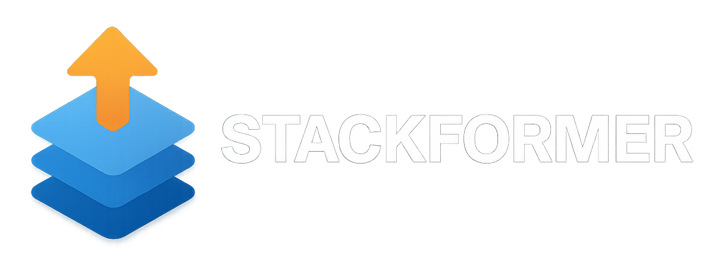

<p align="center">
  
</p>

# Stackformer

## Project Overview

**Stackformer** is a modular deep learning training framework built on PyTorch for transformer-based experimentation and production-style training loops. It combines reusable model building blocks with a trainer/engine stack designed for stability, extensibility, and CPU/GPU portability.

---

## Features

- Modular trainer architecture with separated state, engine, and trainer APIs.
- AMP mixed precision training support.
- Distributed training support via DDP.
- Flexible logging backends (CSV, TensorBoard, Weights & Biases).
- Metrics system for tracking and aggregation.
- Checkpointing and resume support.
- Modular model architecture (OpenAI/Meta/Google-style models + encoder-decoder transformer).
- Robust CI testing pipeline with split workflows.

---

## V3 Milestone

V3 introduces a stronger training infrastructure focused on practical deep learning workflows:

- AMP support.
- DDP support.
- Centralized metrics system.
- Modular training engine (state + step execution + high-level trainer orchestration).

---

## CI & Testing

Stackformer now uses a **multi-workflow CI pipeline**:

- `core-tests.yml` → `tests/modules`, `tests/utils`
- `model-tests.yml` → `tests/models`
- `trainer-tests.yml` → `tests/trainer`
- `integration-tests.yml` → `tests/integration`

Highlights:

- Python version matrix for 3.9, 3.10, and 3.11.
- CPU-safe training tests for portability.
- Integration coverage for model training, save/load, and checkpoint resume.

---

## Examples

Available training examples:

- `examples/simple_train.py`
- `examples/simple_trainer_v2.py`
- `examples/train_ddp.py`

---

## Installation

```bash
pip install .
```

For development:

```bash
pip install ".[dev]"
```

---

## License

MIT License. See [LICENSE](LICENSE).
